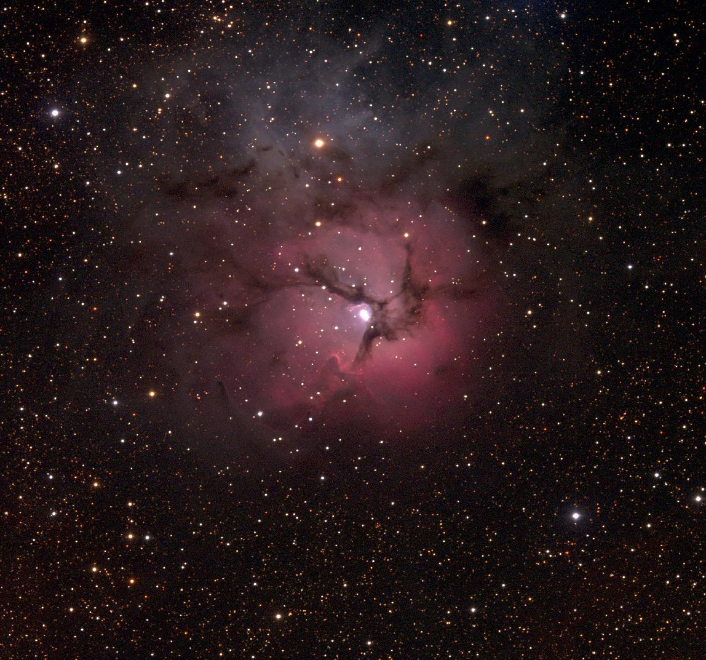
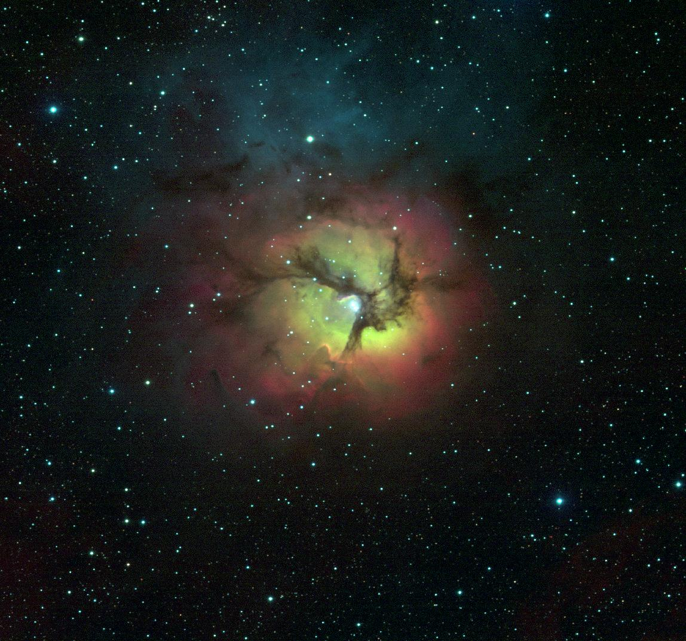
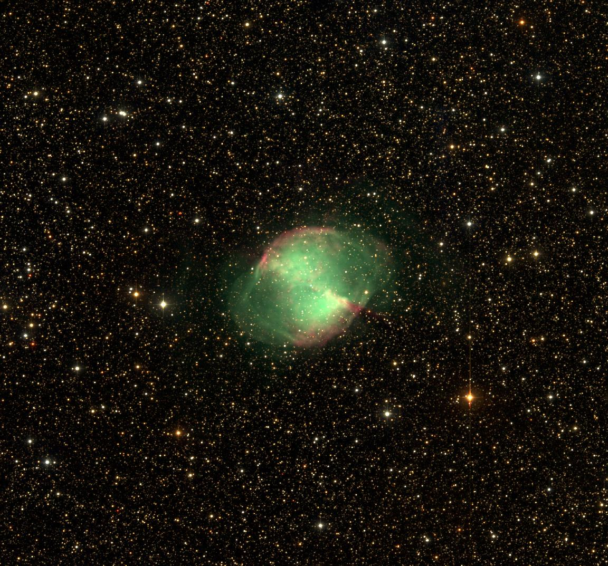
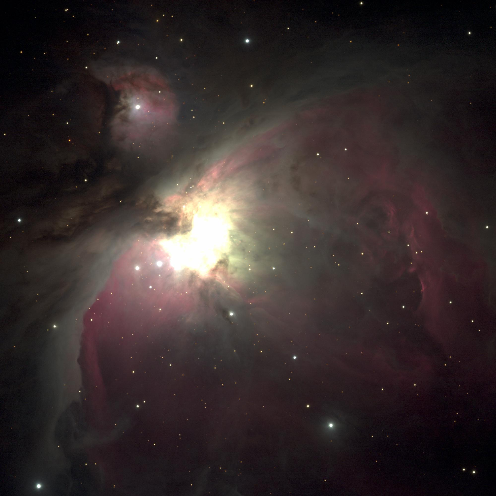
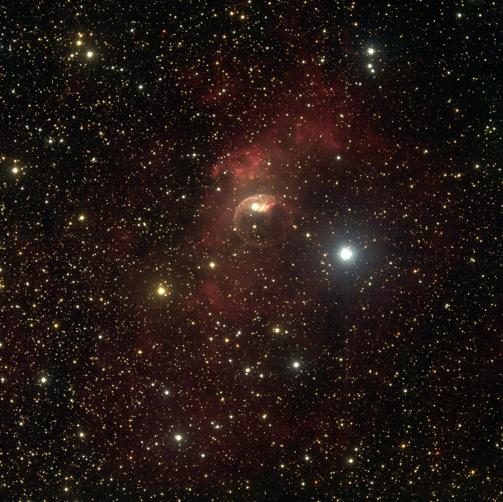
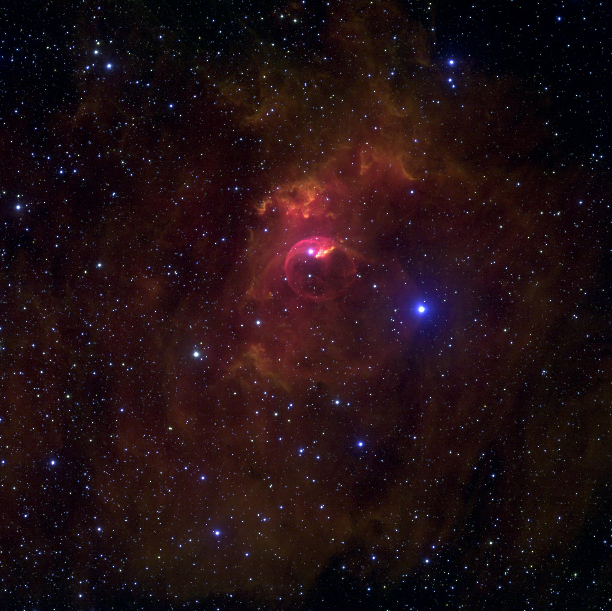

# Astronomy Imaging Project

| Ethan Vogelsang
| evogelsa@iu.edu
| Indiana University
| View on Github: [:cloud:](https://github.iu.edu/evogelsa/astro-image-processing)

---

## Abstract

Imaging astronomical objects is both a scientific and an artistic process. In
order to truly learn about an object in space, many different pictures must be
taken, and each picture must be taken with different filters. These filters
provide specific data which can then be later combined inside of image
processing programs such as Photoshop or through other means. This project
explores using python to facilitate the combination of simple image data into
three channel color pictures. A simplified method of tweaking image parameters
allows for quick processing of images without the higher level GUI elements of
a program like Adobe Photoshop. Exploring the use of python to create these
processed images allows for future automation of the process to quickly produce
large volumes of image data.

## Design

The design rationale for this project was to create a mostly automated
tool to combine image data into a three channel color image. Producing just the
raw image takes the color channels as provided and merges them into a color
image without any additional processing. However due to the artistic nature of
producing these images, it was also important to provide some interface for
tweaking basic image properties like saturation, contrast, brightness, etc.
Because of this, additional GUI elements allow for basic adjustment of these
parameters.

A useful feature of a program like Adobe Photoshop is its denoising and other
high level image processing features. An attempt to produce similar
functionality was made by using OpenCV's fastNlMeansDenoising method. However
this type of denoising is not meant for astronomical data and tends to over
process the image and reduce detail in key areas.

Future design improvements would include entirely command line based processing
of these images and further steps towards automation. The goal of this program
is not to fully process images, but rather to quickly and efficiently combine
the data to produce a basic result which can later be post processed in a
proper image editing software, such as Photoshop.

## Results

Overall the results are promising. Using this program is an effective way to
quickly produce multiple images and tweak as necessary without relying on heavy
weight GUIs. Creating this tool has facilitated the learning about the
composition of multiple astronomical objects. Viewing and creating images from
multiple filters such as H-alpha, [SII], [OIII], and the visible light spectrum
allows for multiple properties of these deep space objects to be ascertained.
For example using a narrowband filter like H-alpha allows for viewing the
most active regions of emission nebulae. [SII] and [OIII] can provide similar
utility. By viewing the amount of light gathered with these filters, it is
possible to extrapolate about the chemical composition of these deep space
objects.

Example images below. Filters used are listed in order of RGB channels, i.e.
"R, [OIII], B" indicates red broadband used for red channel, [OIII] for the
green channel, and b for the blue channel.

### Messier 20 | Trifid Nebula | R, V, B

### Messier 20 | Trifid Nebula | H-alpha, [OIII], B

### Messier 27 | Dumbbell Nebula | R, V, B

### Messier 42 | Orion Nebula | R, V, B

### NGC 7635 | Bubble Nebula | R, V, B

### NGC 7635 | Bubble Nebula | H-alpha, [SII], B

More processed images available in the Github repository.

## References

All image data taken from [WIYN 0.9m Telescope](https://iu.instructure.com/courses/1888868/pages/data-from-the-wiyn-0-dot-9m-telescope)
